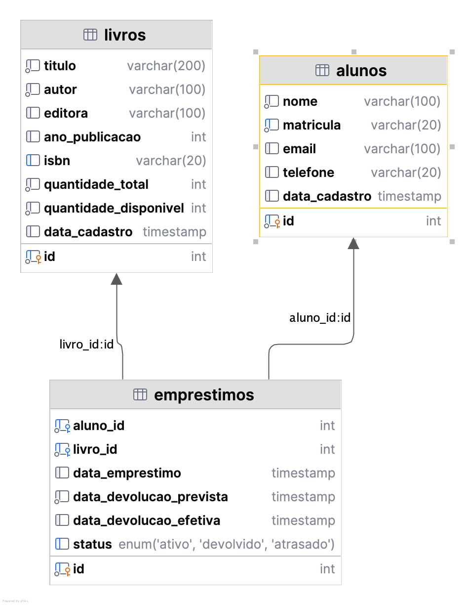

# Sistema de Gerenciamento de Biblioteca

Este é um sistema de gerenciamento de biblioteca desenvolvido em Java, com persistência de dados em MySQL. Ele permite o cadastro e controle de livros, alunos e empréstimos, através de uma interface de linha de comando interativa.

## Funcionalidades

- Cadastro, consulta, atualização e remoção de livros
- Cadastro, consulta, atualização e remoção de alunos
- Registro e gerenciamento de empréstimos de livros
- Consulta de disponibilidade de livros
- Relatórios de empréstimos por aluno
- Interface interativa via linha de comando

## Pré-requisitos

- Docker e Docker Compose
- Git

## Estrutura do Projeto
```
.
├── Dockerfile              # Configuração para construção da imagem Docker
├── Main.java               # Classe principal que inicia a aplicação
├── docker-compose.yml      # Configuração do ambiente Docker
├── run.sh                 # Script para compilar e executar a aplicação
├── sql-scripts/           # Scripts SQL para inicialização do banco de dados
│   └── init.sql           # Script de criação de tabelas e dados iniciais
└── src/                   # Código-fonte da aplicação
    ├── model/             # Classes de modelo (entidades)
    ├── repository/        # Classes para acesso ao banco de dados
    ├── service/           # Classes de serviços (lógica de negócios)
    └── ui/                # Interface com o usuário
        └── BibliotecaUI.java # Interface principal da aplicação
```

## Configuração e Execução

### Iniciando a Aplicação com Docker

1. Construir e iniciar os contêineres:

```bash
docker compose up -d
```

2. Conectar ao contêiner da aplicação para interagir com a interface:

```bash
docker attach trabalho-banco-de-dados-app-1
```

### Parando a Aplicação

```bash
docker compose down
```

Para remover os volumes persistentes (cuidado, isso apagará todos os dados):

```bash
docker compose down -v
```

## Modelo de Dados

### Livro
- **ID**: Identificador único do livro
- **Título**: Título do livro
- **Autor**: Nome do autor
- **Ano de Publicação**: Ano em que o livro foi publicado
- **Disponível**: Status de disponibilidade para empréstimo

### Aluno
- **ID**: Matrícula do aluno
- **Nome**: Nome completo do aluno
- **E-mail**: Endereço de e-mail para contato
- **Telefone**: Número de telefone do aluno

### Empréstimo
- **ID**: Identificador único do empréstimo
- **ID do Livro**: Referência ao livro emprestado
- **ID do Aluno**: Referência ao aluno que pegou o livro emprestado
- **Data de Empréstimo**: Data em que o livro foi emprestado
- **Data de Devolução Prevista**: Data em que o livro deve ser devolvido
- **Data de Devolução Real**: Data em que o livro foi efetivamente devolvido (nulo se ainda não devolvido)

### Diagrama de Fluxo de Dados



## Desenvolvimento

### Compilação Manual

Para compilar manualmente o projeto:

```bash
javac -d ./target -cp "./lib/*" $(find ./src -name "*.java") src/Main.java
```

### Execução Manual

Para executar a aplicação manualmente:

```bash
java -cp "./lib/*:./target" Main
```

## Solução de Problemas

### A aplicação não está aceitando entradas

Certifique-se de que está conectado ao contêiner corretamente:

```bash
docker attach trabalho-banco-de-dados-app-1
```

Ou use o comando run:

```bash
docker compose run --rm app
```

### Erro de conexão com o banco de dados

Verifique se o serviço do MySQL está em execução:

```bash
docker compose ps
```

Verifique os logs do MySQL:

```bash
docker compose logs db
```

## Tecnologias Utilizadas

- Java 11+
- MySQL
- Docker
- Docker Compose

## Autores
- Kaio Bruno Soares dos Santos - 2425109
- Raphael Pinheiro Dantas Gomes - 2424151

## Agradecimentos

- Projeto desenvolvido como trabalho para a disciplina de N688 - Ambiente de Dados da UNIFOR
```
